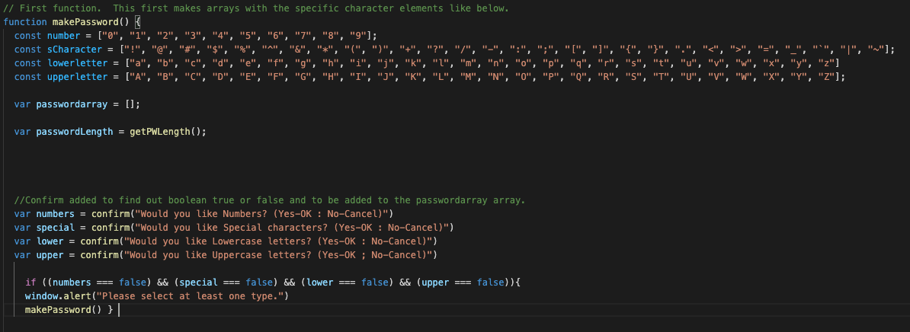
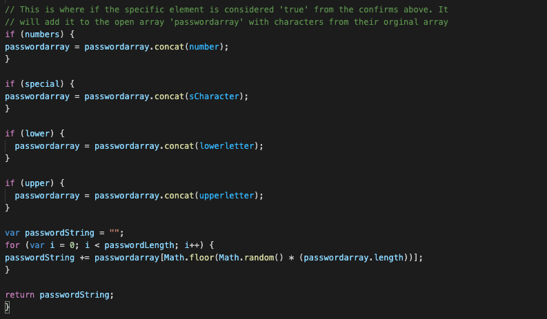
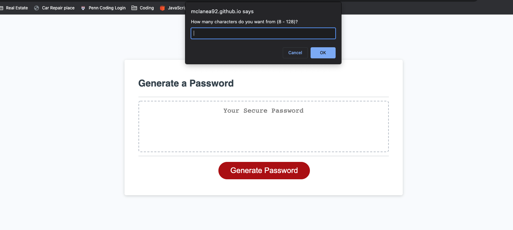

# CodeGenerator

## About Application:
This application is used to create a random password from the criteria that was provided from the user. From 8 to 128 characters, letters, numbers and symbols.  

## List of technologies used
- Javascript
- CSS
- HTML

## User Story
For this homework, a company wants me to create a random password generator.  Starter code was provided.  This password generator
gives the user the ability to pick from uppercase, lowercase, special characters and numbers.  It also asks for the length of the 
password which must be between 8 & 128.  Once finished, you will be able to get random passwords based on the criteria that you 
provided.

## My Task
Create a js file that helps the page respond the way the company asks.  From picking specific characteristics to the length of the password.

## Acceptance Citeria

GIVEN I need a new, secure password
WHEN I click the button to generate a password
THEN I am presented with a series of prompts for password criteria
WHEN prompted for password criteria
THEN I select which criteria to include in the password
WHEN prompted for the length of the password
THEN I choose a length of at least 8 characters and no more than 128 characters
WHEN asked for character types to include in the password
THEN I confirm whether or not to include lowercase, uppercase, numeric, and/or special characters
WHEN I answer each prompt
THEN my input should be validated and at least one character type should be selected
WHEN all prompts are answered
THEN a password is generated that matches the selected criteria
WHEN the password is generated
THEN the password is either displayed in an alert or written to the page

## Deployed URL
https://mclanea92.github.io/CodeGenerator/

## Github URL
https://github.com/mclanea92/CodeGenerator

## Screenshots
This image below shows the arrays made with all the characters broken up into 4 variables in arrays.

The image below takes into account what choices that the user has made to create the password with their specifications.

The image below is a screenshot of when you click generate passwork.  First question is how many characters to use for the password

## License
MIT License

Copyright (c) 2022 Adam McLane

Permission is hereby granted, free of charge, to any person obtaining a copy
of this software and associated documentation files (the "Software"), to deal
in the Software without restriction, including without limitation the rights
to use, copy, modify, merge, publish, distribute, sublicense, and/or sell
copies of the Software, and to permit persons to whom the Software is
furnished to do so, subject to the following conditions:

The above copyright notice and this permission notice shall be included in all
copies or substantial portions of the Software.

THE SOFTWARE IS PROVIDED "AS IS", WITHOUT WARRANTY OF ANY KIND, EXPRESS OR
IMPLIED, INCLUDING BUT NOT LIMITED TO THE WARRANTIES OF MERCHANTABILITY,
FITNESS FOR A PARTICULAR PURPOSE AND NONINFRINGEMENT. IN NO EVENT SHALL THE
AUTHORS OR COPYRIGHT HOLDERS BE LIABLE FOR ANY CLAIM, DAMAGES OR OTHER
LIABILITY, WHETHER IN AN ACTION OF CONTRACT, TORT OR OTHERWISE, ARISING FROM,
OUT OF OR IN CONNECTION WITH THE SOFTWARE OR THE USE OR OTHER DEALINGS IN THE
SOFTWARE.

